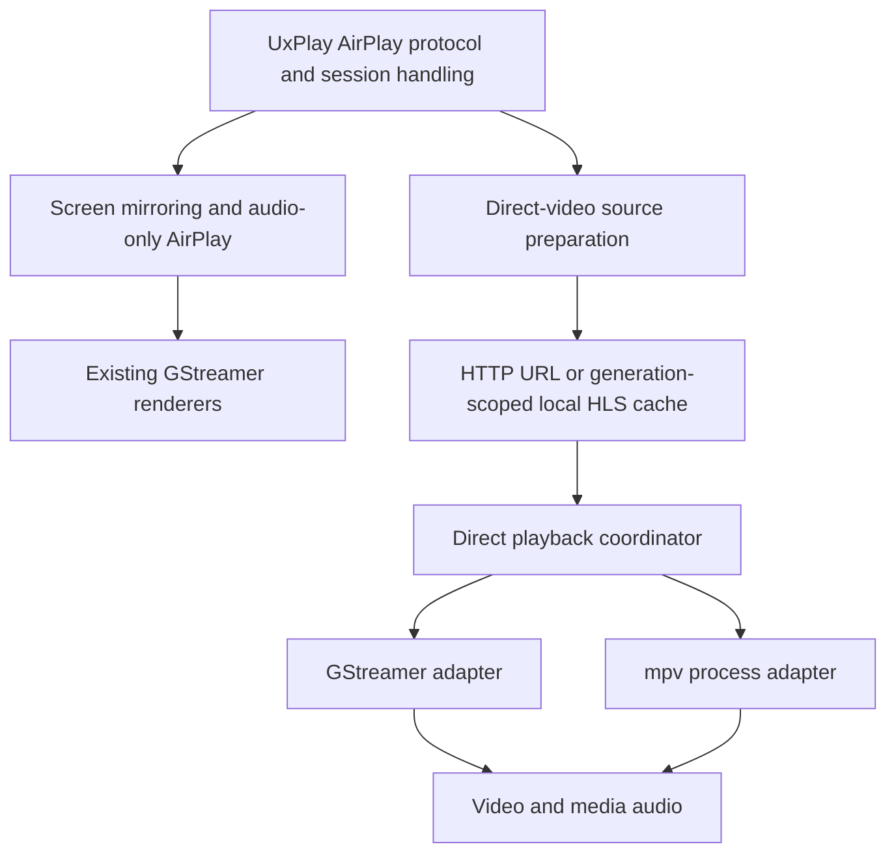

# Optional mpv backend for AirPlay video

Implementation update: the first development implementation is available; see [build, switches and current limits](mpv-screen-development.md). This document retains the broader staged plan.

Draft implementation plan — 10 September 2026. Planning only; no receiver code, packages, configuration or running services have been changed.

Add mpv as an optional player for AirPlay URL/HLS video, behind a configuration switch. Keep UxPlay responsible for AirPlay negotiation and stream preparation, and keep GStreamer for screen mirroring and audio-only AirPlay. For a direct-video session, the selected player handles **both the video and its accompanying media audio**, preserving one playback clock.

First establish whether a matched mpv/FFmpeg build can play the failing HEVC/4K formats on this Pi through a bounded standalone feasibility test. Then integrate an mpv subprocess controlled locally by UxPlay, proving control and output handover with software playback before enabling qualified hardware modes. GStreamer remains the default during development. The future AirPlay OS informs the separation between protocol, playback and device settings; building an OS is outside this work.

## 1. Evidence and scope

This plan was checked against the local `pi-uhf` working tree at base commit `52c2997`, including its existing uncommitted playback/protocol changes. Those changes must be preserved and identified separately when implementation starts.

**User clarification, 10 September:** UHF HD streams work; 4K and HEVC streams do not. Preserve working HD as the regression baseline and make supported HEVC/4K playback the intended improvement. These are user-reported results, not a diagnosis: inspect codec, resolution, profile, bit depth and frame rate for each failing stream. Resolution and codec are independent; HD can be HEVC, and 4K is not necessarily HEVC. Earlier sampled silent-media findings below must not be generalized to all UHF streams.

The latest [fork status](../FORK.md) records a 10 September device test: YouTube picture/sound worked after UHF, the sampled UHF video reached the sink in 1.341 seconds, and three complete UHF fragments contained no real audio samples after UHF stopped its separate audio transport. This is existing recorded evidence, not a new live-device verification. mpv may handle the stream more reliably; it cannot manufacture an absent soundtrack. Time before the phone sends `/play` is also outside the player.

The [Pi performance notes](raspberry-pi-performance.md) record working H.264 hardware output and a later HEVC stop that wedged the kernel in `hevc_d_h265_stop`. The current GStreamer Pi profile disables that HEVC decoder. Changing players does not establish that the shared kernel driver is safe.

Initial coverage:

- AirPlay direct HTTP/HTTPS video, including UHF live and on-demand HLS.
- YouTube playback through UxPlay's existing negotiated playlist cache.
- Play, pause, resume, seek, stop, volume/mute where supplied, progress reporting and session replacement.
- Transition between direct video, screen mirroring and audio-only AirPlay on the same HDMI output.
- HDMI startup/readiness/error feedback and an optional developer stream overlay, specified in the [HDMI status and debug plan](hdmi-status-debug-plan.md).

Excluded: OS images, provisioning, OTA updates, a general settings/control UI, new AirPlay capability advertisements, additional DRM/FairPlay implementations, transcoding services and simultaneous independent players. The requested HDMI status/diagnostic display is in scope. Standard HLS encryption is a compatibility test, not a claim of protected-service DRM support.

## 2. The switch

Proposed new UxPlay syntax, **not implemented commands**:

```text
# Existing configuration, with one additional setting:
hls
airplay-video-backend gstreamer
```

Change the last value to `mpv` and restart the receiver. Equivalent proposed command-line option: `-airplay-video-backend gstreamer|mpv`. Explicit command-line selection overrides the configuration file; omission selects GStreamer.

The same installed receiver supports both players, without rebuilding to switch. For the first version the choice is read at startup and remains fixed for every session in that process. Restarting interrupts active playback. Hot changes during playback are a later feature only if needed.

| Setting | Meaning |
| --- | --- |
| `airplay-video-backend gstreamer` | Existing direct-video implementation. |
| `airplay-video-backend mpv` | All supported direct-video routes use mpv, including the local YouTube cache. |
| `mpv-decode software` | Initial baseline: all video decoding in software. |
| `mpv-decode pi4-safe` | Qualified H.264 hardware path; HEVC hardware explicitly disabled. Unqualified codecs use software within measured limits. |
| `mpv-decode pi4-hevc-experimental` | Separately enabled, version-pinned HEVC hardware experiment. Never selected by the safe policy. |
| `screen-info off|status|debug` | Existing display behavior, normal receiver status screen, or status plus developer overlay. The Pi configuration selects `status`; debug tests explicitly select `debug`. |

When omitted, `mpv-decode` defaults to `software` for the initial implementation. Promote the documented Pi configuration to `pi4-safe` only after qualification. These are receiver policy names, not raw mpv options.

Keep `hls` as the existing AirPlay-video enablement gate. `hls 2` remains a GStreamer-specific choice; selecting mpv with that setting should explain that it has no mpv effect. Preserve the existing `hls-pi4` YouTube rendition filter and GStreamer safeguards. Do not translate GStreamer element names into mpv options.

Validate the selected mpv executable and required control capabilities before service activation. A missing or incompatible mpv is an explicit configuration error. Do not silently change the selected backend during an A/B test or automatically replay a failing stream in another player. Reverting the setting is the immediate rollback route.

## 3. Integration boundary



Keep existing direct HTTP routing and YouTube FCUP playlist collection in `lib/http_handlers.h`. mpv receives the already resolved media location. It does not receive an AirPlay protocol URL or perform YouTube webpage extraction; disable the player’s URL-extraction scripts for this integration.

Introduce a small backend-neutral direct-playback interface with `load`, `pause/resume`, `seek`, `stop`, `set_volume/mute`, `snapshot` and asynchronous events. Its inputs include the session generation, source route, start position and selected device/decoder policy. Its outputs distinguish requested play/pause from loading, buffering, playing, ended and failed.

First wrap the existing GStreamer behavior. Then implement mpv behind the same interface. Reuse the intent/time-validation concepts in `direct_playback_state.h`, while retaining GStreamer-specific preroll and buffering rules in its adapter. Do not impose GStreamer PAUSED/PLAYING mechanics on mpv.

The coordinator serializes commands and owns the active generation. Bind incoming controls, disconnects and teardown to the originating sender/session as well as tagging player events; an old phone must not stop or seek its replacement's playback. HTTP callbacks enqueue commands and read a cached snapshot; they never wait for player startup, network fetches or child termination. Otherwise mpv could wait on UxPlay's local HTTP cache while UxPlay waits on mpv. Update the existing main-loop bus, EOS and renderer-relaunch assumptions explicitly; changing only the `/play` callback is insufficient.

### mpv process contract

Use one supervised child per direct-video session initially. Stop/reap it before granting devices to the next session. This gives replacement events a clear process boundary; measure launch cost before considering a persistent idle player. A separate process limits ordinary player-crash impact, but cannot cure a kernel driver hang.

Use a private inherited socket pair with `--input-ipc-client=fd://N`, after verifying that the selected build supports it. Spawn with an argument array, not a shell. Pass media locations through structured IPC after startup rather than command-line arguments. No public TCP control port is needed. mpv documents both local JSON control and the inherited-descriptor option. [IPC protocol](https://github.com/mpv-player/mpv/blob/master/DOCS/man/ipc.rst), [player options](https://github.com/mpv-player/mpv/blob/master/DOCS/man/options.rst).

Use a maintained JSON parser, bounded messages/queues and request IDs. Handle fragmented/coalesced messages, command errors, process exit, EOF and malformed output. Ignore all old-generation replies. Keep the IPC event reader active throughout loading and stopping. Start without personal configuration, automatic scripts, watch-later persistence or interactive controls; make output/device settings explicit.

Define bounded startup and teardown deadlines. On ordinary userspace failure, request quit, then terminate/kill the owned child if necessary, and reap it. Never block the protocol loop or repeatedly launch replacement children while the old process still owns devices. A process stuck in an uninterruptible kernel wait marks hardware playback unavailable and requires recovery; do not promise that kill, service restart or software fallback will release that device.

Cover receiver crashes too: keep the child in the receiver's service control group, verify service-wide cleanup, and use parent-death/IPC-close behavior where supported. Ensure no duplicate inherited descriptor prevents EOF. Test terminating UxPlay while mpv owns HDMI, then verify ordinary child cleanup and successful receiver recovery.

### AirPlay control and status contract

Map pause/resume, validated absolute seeks, EOF/errors, position, duration and buffering into the existing `playback_info_t` response. Retain pause intent during load, buffering and seek. Preserve the existing playlist-removal position response and stop semantics.

Audit the wire response as well as the adapter: `lib/http_handlers.h` currently treats `duration == -1` as finished, so an unavailable mpv duration must not use that sentinel. Keep terminal state explicit internally and serialize live/unknown duration without triggering teardown. Its existing `loadedTimeRanges` also approximates the remainder of the media; do not present that as measured mpv buffering. Cover ad interruption/resume and volume set before the player starts.

Observe mpv properties/events instead of parsing its terminal status. Candidate inputs include `time-pos`, `duration`, `pause`, `paused-for-cache`, `seekable`, cache ranges, `file-loaded`, `playback-restart` and `end-file`. Unknown duration is valid for live streams. Cache ranges are not necessarily the full server seek window. Never report a fabricated finite duration or readiness solely because the child exists. [mpv commands, properties and events](https://github.com/mpv-player/mpv/blob/master/DOCS/man/input.rst).

Keep player-ready, video-output evidence and physically visible picture as separate measurements. Neither `file-loaded` nor `playback-restart` proves that the projector displayed a frame. Verify volume conversion from the existing AirPlay representation and route direct-media volume to the active player; retain GStreamer volume handling for its audio sessions.

### Cache and output ownership

The existing local HLS handler selects a global `current_video`. Before enabling mpv replacement, give local playlist requests an explicit generation identity, including rewritten child playlist references, or prove that the old reader is fully quiescent before the cache changes. Prefer generation-scoped cache URLs with bounded cache lifetimes so an old player cannot read a new session's playlists. The HTTP listener must continue serving the selected generation while mpv starts.

Confirm local cache access restrictions rather than assuming a `localhost` URL makes the server loopback-only. Preserve required HTTP semantics: relative URIs, byte ranges, redirects, content types, headers and legitimate HLS key fetches. Exercise these through FFmpeg's demuxer before changing the shared cache/protocol implementation. Reject unsupported media schemes, and prevent playlist references from gaining unintended local-file access without breaking needed HTTP/HLS protocols. Do not persist signed URLs, headers, keys or raw player log messages.

Only one owner may hold each required display/audio device. On a mode change, stop the previous renderer, confirm release, then start the next owner. Audit eager GStreamer `kmssink` initialization, held frames, EOS, disconnect and shutdown paths. For direct video, mpv owns video and its HLS/container audio. For mirroring or audio-only AirPlay, GStreamer owns the existing output path. Do not try to repair silent HLS by mixing in an unrelated RAOP session or introducing a second unsynchronized audio clock.

## 4. Raspberry Pi 4 decoding and display

Separate three capabilities: the chip can decode a codec; the installed FFmpeg/mpv build exposes that decoder; and decoded buffers reach the configured display reliably. Each must be demonstrated. A listed decoder, low CPU use, a DMA-BUF or a requested `hwdec` option alone is insufficient.

The Pi 4 product specification lists H.264 decode up to 1080p60 and H.265 decode up to 4K60. Treat these as hardware ceilings, not supported-input guarantees. Bit depth, chroma, profile, level, bitrate, interlacing and output processing still matter. [Raspberry Pi 4 specification](https://www.raspberrypi.com/products/raspberry-pi-4-model-b/specifications/).

| Input | Candidate Linux path | Initial policy and qualification |
| --- | --- | --- |
| H.264, supported 8-bit 4:2:0 profiles through 1080p | Stateful V4L2 M2M through a compatible FFmpeg build; candidate decoder `h264_v4l2m2m` | First hardware target. Enable in `pi4-safe` only after actual decode, display, seek, stop and mode-switch tests. Software remains the baseline. |
| HEVC Main / Main 10, supported 4:2:0 streams | Stateless V4L2 Request through matching Pi FFmpeg and mpv integration | Software initially. Hardware stays experimental because of the recorded stop hang. Test 8-bit and 10-bit independently, then resolution/rate limits. |
| H.264 above Pi limits, unusual profiles/chroma, VP9, AV1 and other unqualified codecs | Software unless an independently verified path exists | Prefer a compatible lower rendition when the source offers one. Do not promise usable 4K software playback. |

Pi-specific FFmpeg support must be checked, not inferred from the presence of the `ffmpeg` command. The Raspberry Pi distribution's Trixie build rules enable V4L2 Request and carry Pi acceleration patches; this does not prove which libraries an installed mpv loads. Start by evaluating matching distribution packages. Only build a private matched mpv/FFmpeg pair if those packages cannot meet the tested requirements. [Pi FFmpeg build rules](https://github.com/RPi-Distro/ffmpeg/blob/pios/trixie/debian/rules), [package history](https://github.com/RPi-Distro/ffmpeg/blob/pios/trixie/debian/changelog).

Distinguish Pi-patched FFmpeg's DRM-based integration from the newer dedicated `v4l2request` hwdevice work. The latter's mpv integration is still an open proposal at this review date, not a shipped capability to assume. A listed `hevc_v4l2m2m` decoder is not evidence of the Pi's stateless HEVC path. Pi-specific 8-bit/10-bit buffer interop also needs qualification. [mpv Request API proposal](https://github.com/mpv-player/mpv/pull/14690), [mpv DRM PRIME implementation](https://github.com/mpv-player/mpv/blob/master/video/out/hwdec/hwdec_drmprime.c), [Linux stateless decoder API](https://docs.kernel.org/userspace-api/media/v4l/dev-stateless-decoder.html).

Do not prescribe a universal `--hwdec=auto` recipe. Inventory the chosen binary's decoder, hardware-device and interop support. Store the tested per-codec mpv options in the device policy. Ensure a software policy also excludes explicitly selected hardware decoder names; conversely, verify actual decoder selection when hardware is requested. If an ordinary initialization failure occurs and devices are released, allow at most one explicit, logged software retry within the same backend. A known kernel hang is not an eligible fallback case.

Maintain a record keyed by Pi model, kernel, mpv, loaded FFmpeg libraries and display stack. Include codec/profile/bit depth, actual decoder, hwdec/interop, output format, dropped frames, A/V drift, CPU, temperature/throttling and clean teardown. Version changes invalidate the relevant qualification. Hardware HEVC must remain opt-in even if a package advertises support.

For Raspberry Pi OS Lite, first evaluate `--vo=gpu --gpu-context=drm` on the existing KMS output. Identify the actual `vc4` DRM device, connector, mode and ALSA HDMI device; do not assume stable card numbering or reuse GStreamer sink strings. Test DRM PRIME import/overlay only where that exact build exposes it. mpv's plain `--vo=drm` is a different output path and is not the hardware-accelerated GPU renderer. [mpv video outputs](https://github.com/mpv-player/mpv/blob/master/DOCS/man/vo.rst).

Run output qualification under the actual receiver service account and service environment. Verify DRM-master/virtual-terminal acquisition and release, device permissions and ALSA access there; interactive playback over a login session is not sufficient evidence. Retain the existing display environment rather than adding a compositor as part of backend integration.

Keep the current working output resolution for the first comparison. HDR presentation, tone mapping, deinterlacing, zero-copy and 4K playback each require separate qualification. A 1080p display mode does not reduce the work of decoding a 4K compressed input. Keep the current YouTube H.264/AAC rendition filter during initial A/B tests; mpv's HLS track/variant selection must be measured separately rather than assumed to behave like GStreamer adaptation.

## 5. Implementation sequence and completion gates

Before the full adapter implementation, run a bounded feasibility experiment on representative HD HEVC and 4K HEVC streams, including Main10 if used by the actual sources. Compare local fixtures with equivalent HTTP/HLS playback to distinguish decoder/output failures from delivery failures, then test the actual failing UHF AirPlay path during integration. Confirm hardware use, advancing picture, sound where present, and repeated clean seek/stop. Device-taking tests need a controlled playback window with the working receiver preserved. This is a planned experiment, not an action performed while drafting this document.

If the matched userspace cannot establish this path on the current kernel, retain the switch design but record the hardware objective as blocked by that specific finding. A separately scoped kernel/driver compatibility investigation may be needed; neither more IPC integration nor a software-only mpv demonstration resolves that limit. For 4K H.264 or other formats outside the Pi's advertised acceleration limits, document a compatible lower source rendition or a different decoding platform as the available route, without adding transcoding to this implementation.

| Stage | Deliverable | Gate before proceeding |
| --- | --- | --- |
| 0. Freeze the comparison baseline | Identify existing dirty changes; archive exact source, active release/config and multimedia versions. Inventory mpv availability, linked FFmpeg, codec support and device permissions without taking over playback. | Reproducible working GStreamer baseline and a package/build choice for mpv. No package/kernel upgrade bundled into integration. |
| 0a. Prove HEVC/4K feasibility | Bounded standalone mpv tests of representative failing codecs/profiles using local and HTTP/HLS fixtures on the actual Pi output. | Verified hardware decode, picture and applicable audio, plus clean seek/stop; otherwise identify the exact build/driver/output blocker before substantial integration work. |
| 1. Introduce the switch and adapter | New option and configuration validation; GStreamer adapter around current behavior; common session/control snapshots. | Existing playback/protocol tests pass; GStreamer behavior and rollback remain intact; selection needs no rebuild. |
| 1a. Add HDMI feedback | Status snapshot, idle/readiness/error surface and qualified GStreamer overlay; build independently of the HEVC experiment. | Accurate Ready/incoming/failure feedback, working HD preserved, recoverable VT/output ownership, and measured overlay overhead. |
| 2. Add mpv with software decoding | Child supervision, private IPC, direct HLS and local YouTube cache, controls/status, audio and display handover. | Real picture and sound on known-good media; mode transitions, stale events, failed streams and process failures recover. Silent-source fixtures may remain silent but must not stall video. |
| 3. Qualify Pi 4 H.264 hardware | Tested decoder/output policy and explicit software fallback; package/source identity recorded. | Actual hardware decode and output verified, repeatable seek/stop, acceptable frame delivery and no GStreamer regression. |
| 4. Evaluate HEVC hardware separately | Pinned experimental profile on the exact driver/library combination. | Repeated stop/seek/replace tests and soak pass without kernel blockage. Any hang stops qualification; safe profile remains software HEVC. |
| 5. Compare and select | Same release, same stream set, same device settings; backend is the changing variable. | Review recorded results before changing the default. OS work remains deferred. |

Suggested code boundaries:

- `uxplay.cpp`: option parsing, protocol callbacks, main loop, renderer lifecycle and volume routing.
- New `renderers/direct_video_backend.h` and coordinator implementation: narrow interface and serialized session state; names provisional.
- New GStreamer/mpv adapters; existing `video_renderer.c` retains mirroring and GStreamer-specific direct playback machinery during extraction.
- `lib/http_handlers.h` and cache helpers: only the generation/access/compatibility changes demonstrated necessary by integration tests.
- `renderers/CMakeLists.txt`, top-level CMake and package files: optional mpv adapter/JSON-parser build support; GStreamer stays required. The Pi test build includes both adapters. Selecting a compiled-out backend fails clearly.
- `scripts/pi-dev` / `scripts/pi_remote.py`: selected-backend preflight and release metadata for executable/library/configuration identity.
- Existing documentation and manual: switch, device policies, capability report and rollback.
- New status snapshot/presenters and receiver readiness hooks: implement the [HDMI feedback contract](hdmi-status-debug-plan.md), including mpv OSD, GStreamer overlay and VT/display ownership.

Prefer an optional runtime mpv package dependency for the subprocess approach, without linking libmpv or FFmpeg into UxPlay. If custom media libraries are necessary, install them under an isolated versioned prefix and scope their loading to the mpv child. Record source revisions, patches, build options and hashes. Do not globally replace FFmpeg, GStreamer or library search paths. Retain the project's separate release/configuration snapshots and original receiver rollback paths. Distribution of a future image will require an appropriate component/source/license manifest; producing that image is not part of these stages.

## 6. Verification and evidence

Automated tests should target observable failure modes:

- A fake IPC child exercises partial replies, out-of-order command completion, oversized/malformed messages, EOF, exit during loading, timeout and old-generation events. Verify no shell interpretation and no media secrets in diagnostics.
- Backend contract tests cover pause during load, stop/seek races, long VOD seeks, unknown live duration, nonseekable media, terminal errors and replacement. Existing GStreamer regressions continue running.
- Generated HTTP fixtures cover MPEG-TS and fMP4 HLS, relative/ranged requests, separate audio renditions, empty/late/interrupted audio, discontinuities, redirects, HTTP errors, stalls, encrypted HLS/key failure and expired resources. Preserve the current missing-audio and replacement fixtures as comparisons.
- Exercise actual YouTube cache handling, missing/unavailable variants, cache generation changes, repeat `/play` and delayed old HTTP reads with mpv. A generic local file test cannot establish this compatibility.

On the Pi, record a matrix for both backends: known-good YouTube A/V, UHF live, UHF VOD, the problematic UHF source, mirroring with audio, and audio-only playback. Include H.264, software HEVC, then separately qualified hardware modes. Test pause/resume, long seek, volume/mute, channel changes, UHF ↔ YouTube, video ↔ mirroring, video ↔ audio-only, phone lock/background, disconnect/reconnect and two-phone handover.

Proposed qualification minimum: ten startup samples per representative stream/backend, twenty mixed stop/seek/replacement cycles per enabled hardware path, and a one-hour mixed-codec soak. These are initial sampling gates, not a guarantee of universal reliability. Record median and worst observed startup plus failures; expand samples if results are variable.

Measure phone selection → request, request → player-ready, request → backend output evidence, and observed picture/sound separately. Require no new receiver crashes, orphaned device-owning children, kernel hangs or lost ability to return to mirroring/audio. Agree acceptable frame-drop, A/V-sync and startup budgets from the measured baseline before performance tuning. A healthy service PID alone is never a playback pass.

Record `screen-info` mode with every measurement. Verify actual HDMI status/overlay output in both backends, including before the first stream, failed startup and return to idle; compare debug on/off so overlay work cannot silently change decoder selection or distort the HEVC/4K comparison.

The first shipped deliverable is **the same receiver build playing known-good AirPlay video through either backend using one setting, with reliable controls and return to GStreamer mirroring/audio**. That establishes the switch, not completion of the HEVC/4K objective. The playback improvement requires the actual supported HEVC/4K UHF streams to pass the phone-to-projector tests while working HD stays intact; standalone feasibility evidence alone is insufficient.

## 7. Architecture retained for the future

Keep three small, explicit boundaries: AirPlay protocol/session handling, a replaceable direct-video player, and a versioned device policy. Let the current service supervise the receiver and its owned player child. Centralize output ownership and sanitized diagnostics so they can later support an appliance UI or OS service. No additional daemon framework, compositor, image builder, provisioning system or update service is needed now.
