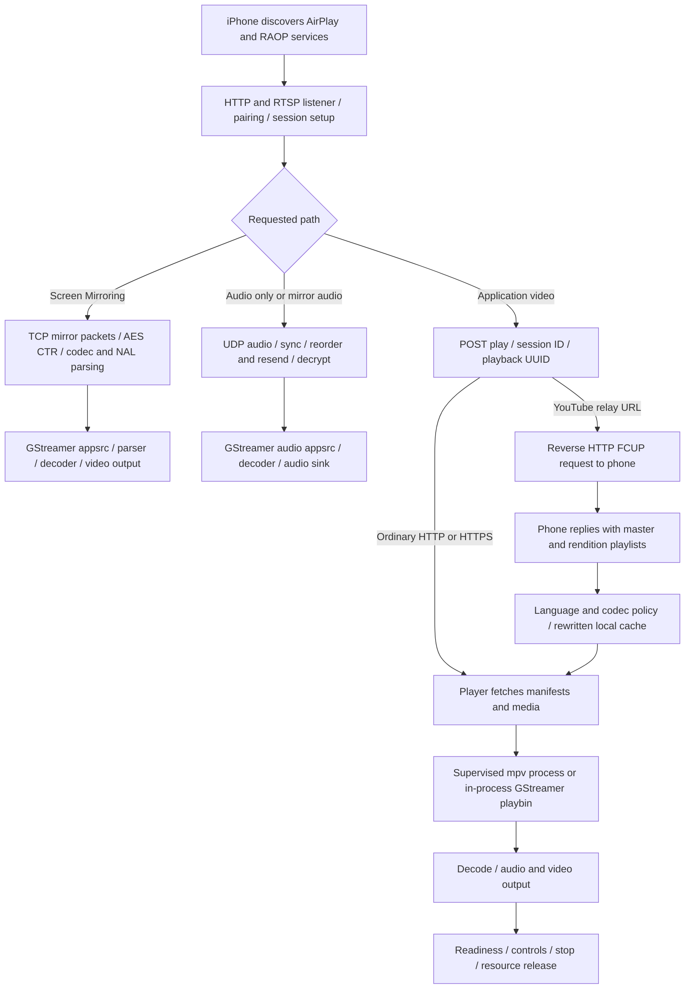

# AirPlay reliability audit — 13 September 2026

This audit follows the current working tree from discovery and incoming control requests through source acquisition, decoding, presentation and cleanup. It includes source changes and synthetic failure/recovery tests. It does **not** establish that the iPhone's intermittent failures have been eliminated. The initial audit preserved the running receiver; the user subsequently started the prepared temporary device trial and reproduced E3, as recorded below.

## Conclusion

There are real receiver bugs here, including defects that prevent a transport from restarting after an error. The main weakness is inconsistent session and resource ownership across the protocol, source resolver and playback workers. Changing mpv, GStreamer or the programming language alone would leave much of that behavior intact.

I recommend keeping the existing backend choices while first making every failed playback attempt terminate predictably and permit a new attempt on the same phone connection. Next, isolate the remaining GStreamer workers from the protocol service. A separate Shairport Sync audio comparison is worthwhile. A whole application rewrite is not the first investment I would make.

## The actual receive-to-play paths



The principal code boundaries are:

| Stage | Implementation | Recovery implication |
| --- | --- | --- |
| Discovery and admission | `uxplay.cpp`, `lib/dnssd.c`, `lib/raop.c` | Being discoverable says nothing about whether an old playback owner has released resources. |
| Control transport | `lib/httpd.c`, `http_request.c`, `raop.c`, `raop_handlers.h` | One listener thread dispatches several sockets. A blocking callback or write can delay other sessions. |
| YouTube source acquisition | `http_handlers.h`, `fcup_request.h`, `airplay_video.c` | This occurs before a decoder starts. Apple session, playback UUID, cache lifetime, request ID and reverse socket all matter. |
| Mirroring | `raop_rtp_mirror.c`, `mirror_buffer.c`, `video_renderer.c` | Encrypted TCP framing, decoder configuration, timestamps and restartable worker cleanup must all succeed. |
| Audio transport | `raop_rtp.c`, `raop_buffer.c`, `raop_ntp.c`, `audio_renderer.c` | Sender liveness, arrival of usable audio, retransmission deadlines and actual output are separate facts. |
| Direct playback | `uxplay.cpp`, `mpv_backend.c`, `video_renderer.c`, `direct_playback_state.h` | mpv is already a supervised process; GStreamer still shares the receiver process. |
| Display and service recovery | `screen_status*`, display helpers, `uxplay.cpp` | A local error screen or a healthy service does not prove that the phone received a terminal playback state. |

Several good protections already existed and are preserved: cache namespaces, session and request correlation, obsolete-message rejection, mpv process reaping before replacement, bounded mpv IPC queues, renderer generation checks, and separate playback intent from buffering. These are not newly credited to this audit.

## What E3 establishes

**E3 is this project's display code for `SCREEN_ERROR_SOURCE`, “Stream data unavailable.” It is not a specific Apple protocol diagnosis.**

The retained 13 September trace shows session 13 accepted, a master playlist received, and English selected from 21 languages. It fails 983 ms after acceptance, before the Pi mpv preparation summary and before player launch. That narrows this instance to source preparation, including URI extraction, rewriting or compatibility/dependency filtering. It does not implicate mpv decoding, HDMI or audio output. The trace does not contain enough information to identify the exact rejected field.

The audit fixes several defects in that region and adds URL-free rejection counts: unsupported codecs, resolution/frame rate, unavailable routes/groups and missing local resources. This makes the next occurrence distinguishable. The H.264/AAC Pi profile remains a deliberate restriction; it has not been relaxed speculatively.

Evidence: [maintained playback findings](../playback-findings.md), local ignored `.pi-dev/display-service-20260913/youtube-e3-recurrence.log`. The saved trace is historical evidence inspected during this audit, not a new live reproduction.

### Live recurrence during the first candidate trial

The user reproduced E3 on the prepared candidate on 13 September, before 07:07 UTC. SSH confirmed the active executable was release `20260913T065029688087Z-52c2997e3800-dirty`, PID 2670, using the prepared trial configuration. The systemd display service was intentionally stopped while the bounded trial owned the display.

The new diagnostics show the exact failed stage: `pi-mpv-profile`, during preparation, with 17 extracted relay routes and 15 variants. Ten variants were rejected for unsupported codecs. The remaining five passed codec, resolution and frame-rate checks, but all five failed linked-media-group validation: `unavailable_groups=5`, `unavailable_routes=0`, `missing_local_resource=0`. The failure followed request acceptance by 100 ms. No player had started.

The first candidate did not report the missing group types or route categories, and the raw master was not retained. Therefore this trace establishes the group-matching failure but does not establish whether the missing dependency was audio, subtitles, captions or another video rendition. A separate reproduction demonstrates that directly fetchable HTTP(S) audio/subtitle renditions were incorrectly removed because they were absent from the phone-relay cache table. That is a real source-preparation bug; whether it caused this particular YouTube failure still requires a repeat with the corrected candidate and more precise diagnostics.

Local incident evidence: `.pi-dev/reliability-audit-20260913/e3-live-20260913.log`. Source URLs and sender-supplied identifiers are deliberately excluded from the added ordinary diagnostics.

At 07:17 UTC the trial had ended. The installed `uxplay.service` was observed active with supervisor PID 3150, zero automatic restarts, the original installed display package, and its original receiver release `20260912T213424529464Z-52c2997e3800-dirty` (PID 3283). This verifies the first trial's restoration on the device; it does not verify picture, sound or phone-side recovery.

## Bugs fixed

| Area | Before | Change and meaningful regression |
| --- | --- | --- |
| Mirror and audio worker cleanup | A worker could exit and clear `running`; `stop()` then returned without joining it or closing its listener/UDP sockets. A subsequent start refused the still-unjoined worker. | Cleanup now joins an unjoined worker even after it has exited. Separate tests repeat exit → stop → new listener → stop twenty times and check descriptor closure. Recovery requires the owner to invoke stop; this is not a claim that every abrupt disconnect now recovers automatically. |
| Mirror packet handling | Short packets could consume more remaining AES keystream bytes than their buffer length. NAL prefix and codec-configuration lengths were read before checking available bytes. | Bound every residual-byte consumption and validate lengths before access. Tests compare 1,024 encrypted chunk patterns, including rekey, and exercise truncated/empty/oversized NAL/configuration data. |
| Mirror resource release | Header EOF lost the previous socket descriptor; partial buffers and periodic report plists leaked. An unsupported-codec path could stop/join its own thread. | Close/free resources and let the owner perform worker cleanup. A HEVC NAL bit-mask precedence error was corrected in the same parser. |
| HTTP connection progress | Receiving fewer than eight initial bytes made the single server thread wait inside `recv()` for the remainder. A full reverse-response buffer could put its logging terminator out of bounds. | Save partial prefixes across readiness-loop iterations; reserve the terminator byte; correct PTTH marking. An interrupted one-byte request no longer prevents another client getting a response. Failed/zero-length response writes close the affected connection. Blocking writes in general remain a limitation. |
| HTTP listener recovery | A failed listener loop became unjoinable and could not restart; interrupted `select`/`accept` calls could unnecessarily end the listener. | Join an exited thread, explicitly initialize/destroy its mutex, report actual running state, and retry interrupted/transient socket operations. Tests inject fatal and interrupted calls, verify descriptor closure and repeatedly restart the same server. |
| Source cancellation | A delayed FCUP reply after Stop, or after a terminal preparation failure, could advance the old request and start playback. | Mark incomplete acquisition canceled; ignore its late replies. A fresh play on the same session creates a new acquisition. Tests cover both Stop and error cancellation. |
| Failure and Stop reported to the sender | A pre-player source failure or Stop left mpv's older generation visible to the feedback adapter, which could report the new request as buffering indefinitely. | The mpv feedback adapter reports failed, stopping and completed requests as terminal before considering the old player snapshot. Tests cover Stop before player launch and after replacing a playing request, then start another video without recreating the receiver. Full reverse playback-state events remain future work. |
| Playlist URI and language parsing | URI extraction truncated query strings at `m3u8`, mishandled extensionless routes and could scan beyond the supplied length. Language parsing assumed ordering, small language codes, repeated groups and defaults. | Preserve exact URI strings, respect lengths and parse relevant playlist entries. Language selection handles long tags, one rendition, missing defaults and reordered metadata. Signed source URLs no longer lose their query here. Relative routes remain a separate gap below. |
| Initial master URL identity | `/play` accepted a signed master but its exact reply failed later matching; a queryless reply could instead advance collection. Substring admission also accepted invalid paths, including a bare master that reached an assertion. | Validate the final pathname before accepting a play and preserve the exact requested query through response correlation and cache serving. Scoped and legacy tests reject incorrect queries and malformed plays while keeping the current acquisition usable. |
| Condensed playlists/cache lifetime | CRLF or incomplete condensed fields could dereference NULL; repeated store destruction retained a freed pointer. | Validate fields and expand with checked allocation; ordinary CRLF playlists remain valid; invalid cache expansion returns an HTTP error. Clear destroyed pointers and cursors. |
| Late/malformed controls | A missing `=` in a seek/rate request could crash. Property updates after teardown asserted a playlist existed; an incomplete selection freed a child plist still owned by its parent. | Reject invalid numeric controls, guard current-session property changes, preserve borrowed plist ownership, ignore empty language values. Invalid unaccepted play requests no longer reset another active session. |
| Connection ownership | Closing a cache/control socket flushed the global mirror renderer. | Only a connection that owned a mirror transport may flush it. A regression closes four non-media connection types and asserts no flush. The adjacent NTP stop guard now checks the NTP object rather than the audio object. |
| GStreamer clock ownership | One acquired clock reference was released once per audio format, stealing references during repeated rebuilds. | Release it once after setup. Sixteen real create/destroy cycles retain an independent clock reference. This corresponds to [upstream's 11 September fix](https://github.com/FDH2/UxPlay/commit/c3137b6b6d7cad71c20cf8756701e849a630621a). |
| Discovery object lifetime | Names/addresses were freed by unregister rather than by the owning object; initialization without registration leaked them. | Keep metadata until object destruction and release registered services first. LeakSanitizer verifies the existing capability test now frees everything. |
| Player replacement | Malformed IPC from a retiring mpv process failed the newly queued request. | Associate that error with the old child; reap it and keep the replacement. Tests inject malformed JSON, non-object JSON and oversized messages during retirement. |
| mpv startup | `file-loaded` ended a zero-position startup deadline even when playback never restarted. | Keep the existing deadline until the first playback restart, including initially paused starts. A timed-out player can be replaced. This is player progress, not proof of a visible frame. |
| GStreamer feedback and startup error | An empty/starting/stopped renderer could claim ready/healthy; a failed mirror PLAYING transition called process-aborting `g_error`. | Readiness now follows actual request/preroll/buffering state. Mirror startup failure logs, releases the failed pipeline, returns an error and permits a successful retry. |
| Audio startup failure | A failed PLAYING transition stayed selected, so starting the same codec again skipped startup. | Release and clear the failed selection; reject packet delivery until a later start succeeds. A regression injects sink startup failure, verifies cleanup, then observes actual appsrc-to-fakesink delivery after retry. |
| Coverart and mirror timing | Coverart configuration overwrote the mirror synchronization flag; coverart cycling could wait indefinitely for ASYNC completion. | Keep synchronization per renderer and bound the cycle's state wait. Both tests fail against the saved previous renderer. A plugin blocking inside the state-change call itself remains outside this deadline. |
| Song metadata bounds | A child DMAP item could declare more bytes than remained in the received message; decoding its length could overflow signed arithmetic. | Decode lengths as unsigned, reject oversized or missing input before reading it, and allow the next valid metadata update. A deterministic regression proves the original code read beyond the declared request; the corrected path also passes ASan/UBSan/leak checks. |
| Initial RAOP setup | Short encryption fields were copied as full 16-byte IVs and 72-byte keys. Repeated initial SETUP discarded transport pointers without releasing their live workers. | Validate dictionary/type/exact lengths before copying. Reject repeated initial key/timing SETUP with 455 while preserving existing transports. ASan reproduces the original overread; tests retain the same live audio owner through rejected repeats, then pass ordinary subsequent stream SETUP and typed teardown/restart. In-place initial rekey is not implemented; it requires a fresh control connection. |

The HLS syntax changes follow [RFC 8216](https://www.rfc-editor.org/rfc/rfc8216): LF/CRLF, URI lines/attributes, optional language/default attributes and full URI identity. They do not add every HLS extension.

## Remaining weaknesses, in priority order

1. **No single owner for a playback attempt.** State is distributed across global receiver flags, connections, caches, renderer generations and the display. Admission of a new AirPlay control connection can stop RAOP transports before a new `/play` is accepted. Some reset paths close all known connections. A late event or a failure in the wrong phase can therefore affect another path. A session object should own its sockets, cache work, workers and cancellation together.

2. **Source waits lack their own deadlines.** The FCUP queue fetches compatible renditions sequentially. A lost reply can leave preparation waiting while the phone continues sending control feedback. The global silence watchdog will not detect this. The bounded next implementation is an optional HTTP-owner tick on every select-loop iteration, including busy iterations, with monotonic request and overall acquisition deadlines stored in the cache attempt. Expiry should cancel once, report an error only for the still-current attempt, and reject late replies. Start with clean failure; retries or optional-route skipping need a shared queue-advancement/finalization function extracted from `/action`. A separate timer worker would race the current cache lifecycle. The current select timeout is 1.005 seconds, and blocking owner callbacks can still delay deadline delivery. Choose a playable video/audio set first and fetch fallback variants on demand, instead of making every optional route a startup dependency.

3. **The phone does not receive a complete terminal-state conversation.** Local reverse `/event` emission is for FCUP requests; loading/playing/paused/stopped events are not implemented. The [public protocol description](https://openairplay.github.io/airplay-spec/video/events.html) includes these states. Implementing session-correlated terminal events and bounded acknowledgements is a promising way to reduce phone-side stale routes, but this is an inference to validate with actual current iOS captures. The public specification is incomplete and partly describes older devices.

4. **GStreamer/plugin/driver hangs can block the protocol process.** `gst_element_set_state()` can itself wait in a plugin or driver while a shared lock is held; timing out a subsequent state query cannot bound that wait. Mirrored appsrc queues also lack an explicit dropping/backpressure recovery policy. Move output workers into supervised processes with bounded queues and an explicit release acknowledgement. Existing mpv separation is useful; embedding libmpv would remove that protection. An uninterruptible kernel driver can still require device-level recovery.

5. **Liveness is too coarse.** Phone control traffic, arriving media and advancing output need distinct timers. mpv's new first-start deadline does not detect every later freeze; GStreamer still lacks an equivalent complete opening/stall policy. Audio retransmission is driven by missing sequence ranges without a per-range repeat interval/playout deadline comparable to Shairport Sync. Do not fix this by disabling the watchdog or blindly increasing buffers.

6. **Parser and transport scope remains incomplete.** Relative FCUP rendition URIs need proper resolution and cache routing. Cached media playlists are snapshots, not a complete live-FCUP refresh implementation. HTTP has no per-connection idle reclamation, bounded request/body policy or general nonblocking write queue; reverse acknowledgements are discarded without status/framing semantics. The twelve connection slots can remain occupied by idle sockets. Initial master query identity and malformed master-path admission were fixed in the continuation.

7. **Other output issues need separate changes.** Same-codec audio re-SETUP timing remains an upstream-reported issue; a redundant SETUP must be distinguished from a resumed stream. The audio bus guard distinguishes different renderer buses but does not establish complete event-generation isolation when a renderer is reused. Other initialization assertions/exits also remain. These need focused follow-ups or the proposed worker-boundary change; this audit is not a full memory-safety proof.

The UHF sample with no audio packets and the Channel 4 FairPlay key-delivery failure remain separate compatibility boundaries, documented in the existing investigations. Neither can be corrected by recovering a receiver session or choosing a different ordinary decoder.

## Replacement assessment

| Choice | Assessment |
| --- | --- |
| Keep UxPlay, harden lifecycle | Closest fit for existing mirroring plus application video. Upstream continues fixing real defects, but its experimental branch is not automatically a qualified replacement for this fork. |
| Replace with RPiPlay | Older shared ancestry and some identical recovery bugs; it lacks the dedicated remote-video path required here. No evidence it would reduce overall failures. [Repository](https://github.com/FD-/RPiPlay) |
| Shairport Sync for audio | Strong candidate for a bounded Spotify/audio comparison: explicit audio scope, session handling and timed resend policy. It does not replace mirroring or application video and needs coordinated audio-output ownership if combined. [Repository](https://github.com/mikebrady/shairport-sync) |
| Python airplay2-receiver or Go goplay2 | Useful protocol references, largely experimental/audio-focused. Their language choice does not provide the required full receiver behavior. [Python project](https://github.com/openairplay/airplay2-receiver), [Go project](https://github.com/openairplay/goplay2) |
| Replace GStreamer with FFmpeg/mpv workers | Potential isolation/maintenance improvement, but protocol negotiation, FCUP, connection ownership and sender recovery still need fixing. Evaluate with the same real failing stream. |
| Rewrite in Rust or another language | Can reduce future memory-ownership errors in new code. It does not automatically fix protocol state, third-party codec libraries, DRM or driver hangs. Prefer a small explicit session/worker interface first. |

See the [pinned upstream and implementation research](2026-09-13-airplay-reference-review.md) for exact commits, current issue status and additional primary-source links.

## Validation and rollout boundary

All existing working-tree changes were preserved. Tests run against Linux ARM64 with GStreamer 1.26.2 and mpv 0.40.0, using headless output and synthetic senders/workers where stated. The container image initially lacked json-c/mpv, Git and the text-overlay plugin; the dependencies were installed in the isolated test container and recorded in `tests/Dockerfile`. A readiness test also needed to wait for its queued ASYNC_DONE callback rather than only a streaming-thread state change.

| Validation | Observed result |
| --- | --- |
| Fresh mpv-enabled Linux build, final combined CTest suite | 26/26 groups passed, including HTTP HLS, live missing-audio/switching fixtures, mpv failure/replacement and receiver callbacks. Final combined run: 108.50 seconds. |
| Focused ASan + UBSan + leak checks | 8/8 groups passed: HTTP connections, mirror cipher/packets, audio renderer, source/cache handlers, mirror and audio transport recovery. Malformed SETUP coverage is included in the cache-handler group. Metadata bounds/recovery also passed separately with leak detection. |
| Receiver callback integration under ASan + UBSan | Passed, with leak detection disabled for this broad GStreamer fixture. It exposed a test-only temporary-snapshot lifetime error in a string assertion; the test now retains the snapshot through the comparison. |
| Direct renderer under ASan + UBSan | Passed. Leak-enabled coverart coverage reports 320 bytes in three Fontconfig/Pango initialization allocations; not suppressed and not described as a clean renderer leak result. |
| Deployment/display Python suites | macOS: 143 tests run, six platform/privilege skips. Linux unprivileged: 143 tests run, two privilege skips. Those two checks then passed separately as container root. Initial Linux root run used the wrong account for preparation tests and lacked Git; the corrected split exercises both permission contexts. |
| GStreamer-only build | Release executable compiled and `-v` succeeded with mpv disabled. |
| Native Pi build and startup preflight | mpv-enabled candidate compiled successfully. Its binary hash matches release metadata; exact installed receiver configuration and existing pinned mpv/Weston/Wayland dependencies pass the candidate's startup handshake and preflight. The subsequent first device trial reproduced E3 before player launch; successful phone playback is not qualified. |

Local ignored evidence is under `.pi-dev/reliability-audit-20260913/`: `continuation-ctest-frozen.log`, `continuation-sanitizers-frozen.log`, `continuation-receiver-sanitizer-default-build.log`, the Python test logs, `native-build.log`, `native-trial-preflight.log` and `native-candidate.json`. The before-fix metadata and stopped-feedback failures are retained there too.

Several new regressions were run against the saved pre-audit implementation and fail there: blocked HTTP short-prefix handling, truncated URI extraction, shared clock references, premature readiness, fatal mirror startup, retiring mpv errors and lost startup timeout. These establish concrete before/after bugs, not the cause of every observed phone failure.

During initial preparation, no candidate was activated and no services were restarted. The user rebooted the Pi during the continuation; it was then reached at `192.168.1.124`, and the Mac observed both Projector AirPlay and RAOP advertisements. The installed display supervisor remained active with PID 1044 and zero restarts before and after candidate preparation. The subsequent user-started trial and its E3 are recorded above.

The native candidate is `/home/mo/uxplay-dev/releases/20260913T065029688087Z-52c2997e3800-dirty/uxplay`, SHA-256 `fa8fc9500dab19cb944fa688eb1d331e16ee1ae43639ea370b0c501f477f5323`. Its archived source fingerprint is `84032d99c765dc2cd50b62a49a49d216385853fd98bab451cc3e7ae505be022f`. Later changes to this report and the test-only snapshot assertion do not alter the candidate's production code. Prepared trial data is `/home/mo/uxplay-dev/display-trial/prepared-reliability-20260913`.

Accepting a release still requires physical tests: the same iPhone session should recover after failed preparation, Stop during loading, app/video switching, abrupt source disappearance, audio restart and mirror → direct video → mirror, with visible picture and audible sound checked separately. Keep the current installed display package `/opt/piplay/display/releases/20260913T055140Z-77897cc42fa7` and its original staging package `prepared-startup-v3` for restoration. The existing root-supervised display service cannot be replaced by the ordinary `pi-dev deploy` or standalone trial command directly; their account/lock checks correctly refuse it. Activation needs an interactive sudo prompt, which the unattended SSH connection cannot satisfy.

### First device trial (completed)

A one-off launcher was copied into the prepared trial directory. It pins the candidate and installed launcher hashes, checks the exact restoration staging, calls the existing rollback procedure, runs the candidate for at most ten minutes, then reinstalls and checks the original display supervisor. An interrupted or failed trial follows the same restoration path when cleanup is confirmed. If child cleanup is unconfirmed, it refuses to start a competing receiver. Its 14 mocked tests passed, and `--check` passed on the actual Pi without changing the service. These initial checks were followed by the user-started trial, E3 and observed restoration recorded above.

Historical launch command for that first candidate:

```sh
ssh -t mo@192.168.1.124 'sudo /usr/bin/python3 -I /home/mo/uxplay-dev/display-trial/prepared-reliability-20260913/run-device-trial.py'
```

The launcher SHA-256 is `09646974b4bc90b8dec251c6b7c244e407d3f94166875257ab735d3b0fcf3f26`. Its local source/tests/check output are retained in `.pi-dev/reliability-audit-20260913/`. Trial logs remain under `/var/cache/piplay-display/reliability-audit-20260913/`, outside the installed supervisor's cleanup namespace. The existing supervisor's stop/start hooks restore/reapply Wi-Fi power saving, so the trial's network setting may differ from supervised playback; it is not a controlled audio-startup network comparison. The launcher adds no other network changes and makes no permanent candidate installation.

During the trial, repeat YouTube starts and video changes, stop while loading and immediately start another video, then switch mirroring → YouTube → mirroring. Check picture and sound separately, keep the phone on the same network, and record any E3 occurrence or app reset still needed. Permanent activation remains a later step after this real-device check.


### E3 follow-up candidate

The follow-up fixes two demonstrated source-preparation bugs in `lib/airplay_video.c`:

- Direct HTTP(S) audio and subtitle renditions remain in the master even though the phone's FCUP cache does not contain them. Missing local cache routes, including obsolete namespaces and common loopback aliases, still fail validation. Malformed HTTP authorities and ports are rejected.
- Relay-prefix rewriting changes only actual URI starts. A relay-prefix string embedded in a signed query, comment or unrelated metadata is preserved. Both relay and external URLs keep their exact query identity.

The diagnostics now identify missing audio/video/subtitle/caption dependencies and their absent, local, relative, unsupported or malformed route categories using counts only. The diagnostic buffer is enlarged to hold these fields. Codec selection is unchanged. These changes do not implement relative FCUP URI resolution or source-fetch deadlines.

Validation after freezing the follow-up source:

| Check | Observed result |
| --- | --- |
| Cache/HTTP handlers, receiver callbacks and actual mpv HTTP playback | 4/4 CTest groups passed in 11.93 seconds. |
| Actual GStreamer HTTP HLS fixtures | 1/1 group passed in 15.39 seconds. |
| Focused cache/HTTP memory checks | 2/2 passed with AddressSanitizer, UndefinedBehaviorSanitizer and leak detection. |
| External-audio playback regression | Previous finalizer rejects the master. Corrected finalizer preserves the second HTTP origin; real mpv decodes 192 video and 376 audio packets from separate tracks, with zero rejected packets, packet loss or capture errors. Seeking and playback controls pass. Generated-media software decode evidence only. |
| URI rewriting regression | Saved pre-follow-up source fails the exact-output assertion; corrected source passes with bounded, non-NUL-terminated input and embedded prefix text preserved. |
| Follow-up trial launcher | Same restoration logic, repinned to the new release. 14 mocked checks pass; unprivileged `--check` passes on the actual Pi. |
| Follow-up phone trial | The user reported “Working now” after the E3 follow-up and requested this version be committed. SSH confirmed PID 4628 was running the follow-up release with the expected binary hash. This is a successful user-reported retry, not separate qualification of sound, every application, or the full recovery matrix. |

The new native release is `/home/mo/uxplay-dev/releases/20260913T072223643480Z-52c2997e3800-dirty/uxplay`, binary SHA-256 `523609a3297866332eecfc0c7840669029a5a317e5b73da244fef5b19c590267`, source fingerprint `8a760a3d6e8327c09f5f8b2c90622cab891047730fe5f1d35e951b7172e677c1`. It was built on the Pi without switching the service. Prepared trial: `/home/mo/uxplay-dev/display-trial/prepared-e3-followup-20260913`. Launcher SHA-256: `04e8d1aeefb2a1bb83bdae004f24fa6b4b615ed40a7f74067b965ccc522b6e62`. The configuration and pinned output dependencies match the installed package.

To start the new bounded trial, use the Mac terminal; sudo asks for the Pi password:

```sh
ssh -t mo@192.168.1.124 'sudo /usr/bin/python3 -I /home/mo/uxplay-dev/display-trial/prepared-e3-followup-20260913/run-device-trial.py'
```

The user subsequently activated this candidate and reported that playback was working. The trial restores the original display service after ten minutes; committing the version does not change that temporary activation or install it permanently. Separate picture/sound, repeated video switching and recovery checks remain useful follow-up acceptance evidence. The retained first-failure trace does not establish which group URI caused E3, so the successful retry does not uniquely identify which source correction resolved it.

Follow-up evidence is in `.pi-dev/reliability-audit-20260913/e3-followup/`, including the native release metadata, preflight, wrapper checks, CTest and sanitizer logs, and before/after URI-rewrite evidence. The actual-player before/after logs are alongside that directory as `external-audio-mpv-before.log` and `external-audio-mpv-after.log`.
